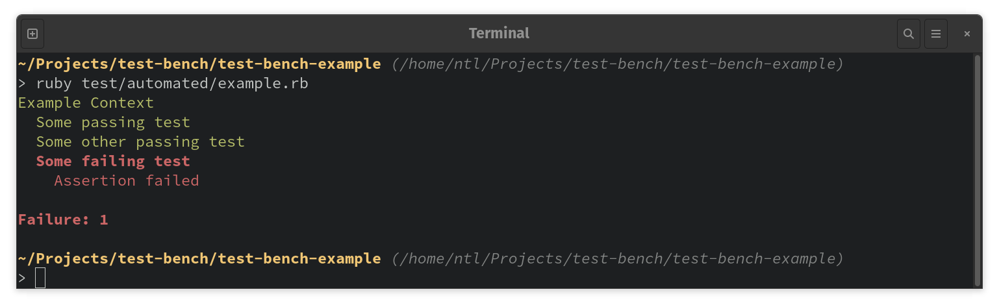

# Test Bench Example

This project includes a test suite that demonstrates most of TestBench's features. Since much of those features involve test failures, the suite can be expected to fail. The purpose of this project is solely demonstrative.

## Installation

Install this project's dependencies locally with `install-gems.sh`:

``` ruby
> ./install-gems.sh
```

Then, run an example test file to verify that you are able to see test output:



## Documentation

For more information, browse the test files themselves, or visit the TestBench repository on [github.com](https://github.com/test-bench/test-bench)
